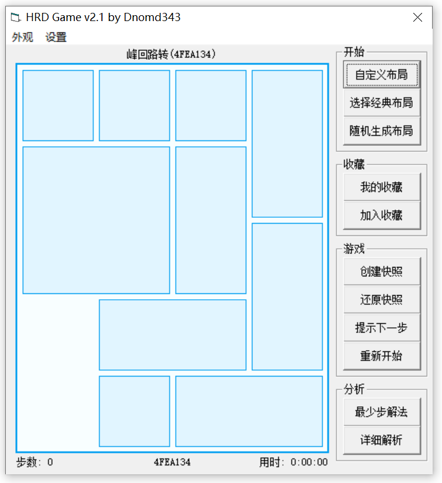
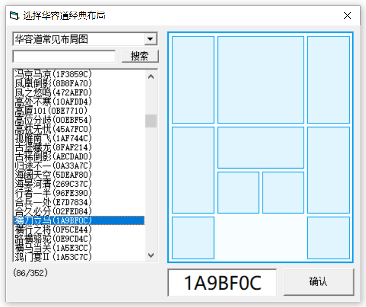
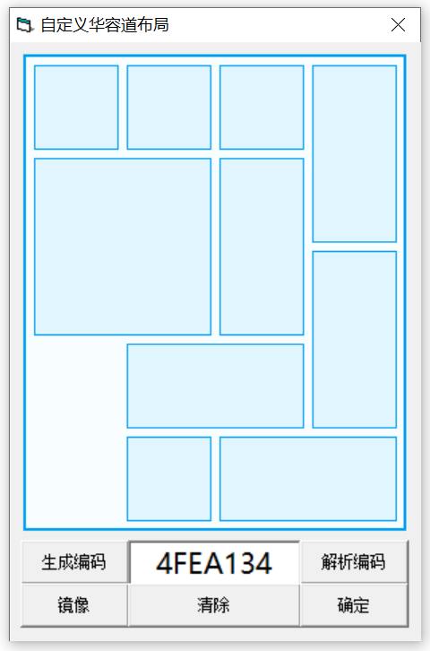
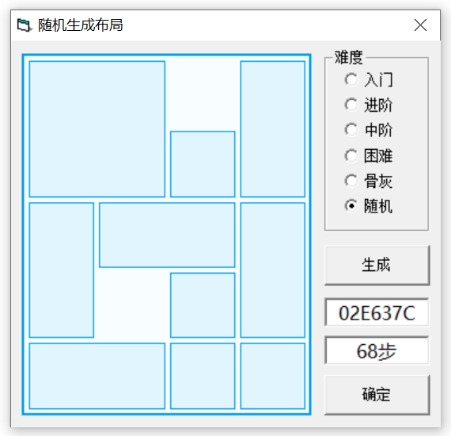
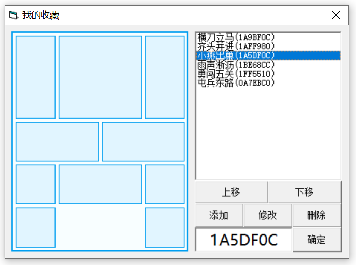
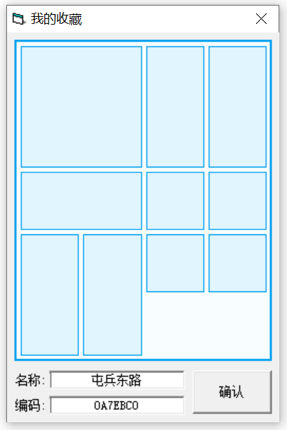
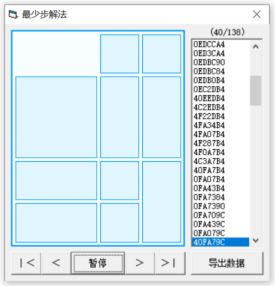
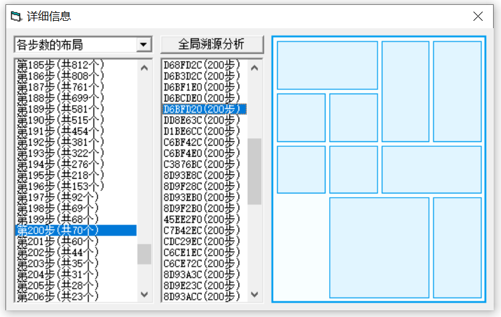

# HRD Game

A Klotski game with both computing and analysis.

这是一个带有计算和分析功能的华容道游戏

*by Dnomd343*

## [下载最新版](https://github.com/dnomd343/HRD_Game/releases/download/v2.1/HRD_Game-v2.1.exe)

# 界面预览

### 主窗口

### 选择经典布局

### 自定义布局

### 随机生成布局

### 收藏布局

### 添加收藏

### 最少步计算

### 详细解析

